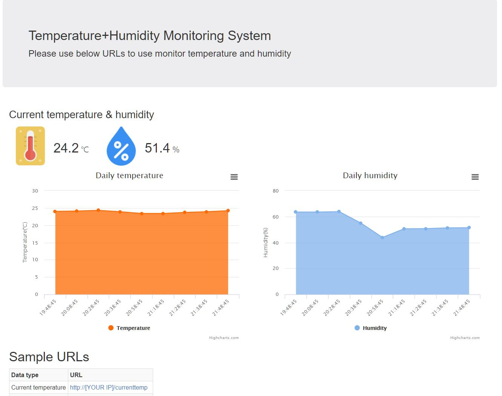

# ESP8266_WEB_DHT_CHART
ESP8266 Web Server + DHT22 + DS3231 + Bootstrap + High Chart Example

1. References
- ESP8266WebServer library from https://github.com/ThingPulse/esp8266-oled-ssd1306  
- DHT library from  https://github.com/adafruit/DHT-sensor-library
- NTP Client library from https://travis-ci.org/arduino-libraries/NTPClient
- RTC library from https://github.com/Makuna/Rtc
- 

2. Tools & Others
 - PlatformIO IDE (https://platformio.org/)  
 - Pingendo IDE (https://pingendo.com/)  
 - Bootstrap (https://getbootstrap.com/)  
  
 3. H/W
 - ESP8266 NodeMCU V2  
 - DHT22 Sensor  
 - DS3231 RTC  
 
 4.Details
 - https://blog.naver.com/eziya76/221407553316
 
 
